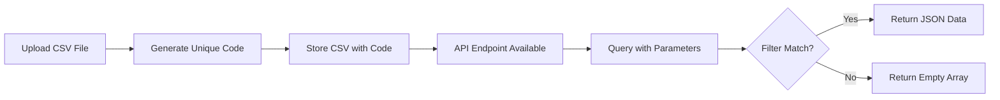
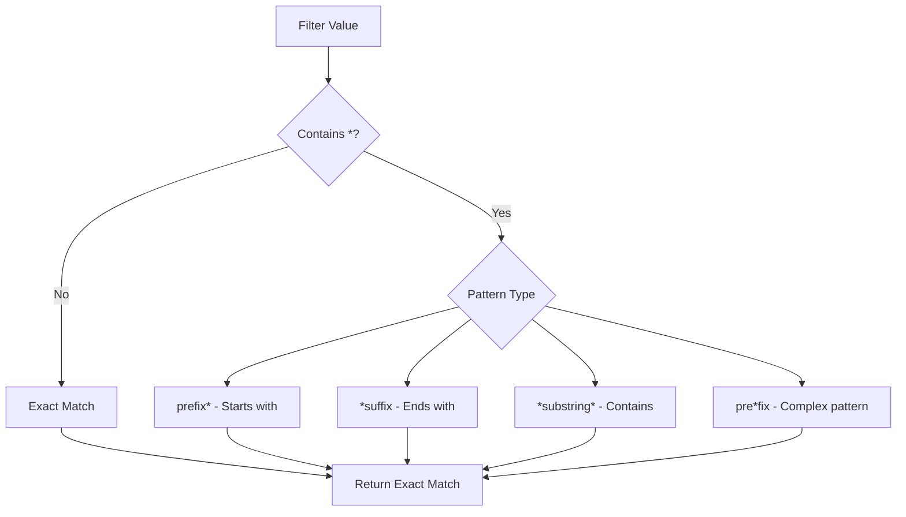
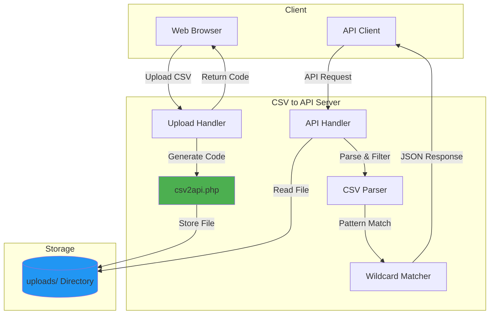

# xsukax CSV to API Converter

A lightweight, self-contained PHP application that transforms CSV files into queryable JSON API endpoints with powerful wildcard filtering capabilities. Deploy a single file and instantly convert any CSV into a RESTful API.


## 📋 Project Overview

The xsukax CSV to API Converter is a zero-dependency, single-file solution that enables rapid API development from CSV data sources. Upload a CSV file through an intuitive web interface, receive a unique access code, and immediately query your data using a clean JSON API with grep-style wildcard pattern matching.

**Core Capabilities:**
- **Instant API Generation**: Transform any CSV file into a JSON API endpoint within seconds
- **Wildcard Filtering**: Query data using flexible pattern matching (`*`) similar to shell wildcards and grep
- **Auto-Detection**: Automatically identifies CSV delimiters (comma, semicolon, tab, pipe) and handles various encodings
- **Single-File Deployment**: No external dependencies, databases, or complex configurations required
- **Modern Interface**: Clean, responsive web UI built with Tailwind CSS

## 🔒 Security and Privacy Benefits

Security and privacy are foundational design principles of this application:

### Data Isolation
- **No Database Dependency**: CSV files are stored as individual files with cryptographically random identifiers, eliminating centralized data exposure risks
- **Unpredictable File Codes**: Generated using `bin2hex(random_bytes(8))` combined with microtime-based hashing, creating 24-character hexadecimal codes that are computationally infeasible to guess
- **No User Tracking**: The application does not collect, store, or transmit user information beyond the uploaded CSV files

### Input Validation and Sanitization
- **Comprehensive Input Sanitization**: All user inputs are processed through `htmlspecialchars()` with `ENT_QUOTES` and UTF-8 encoding to prevent XSS attacks
- **Strict MIME Type Validation**: Uploaded files are verified using PHP's `finfo` extension to ensure only legitimate CSV files are accepted
- **File Size Enforcement**: Hard limit of 5MB per file to prevent resource exhaustion attacks
- **Regex Pattern Validation**: File codes are validated against strict hexadecimal patterns to prevent directory traversal and injection attacks

### Error Handling
- **Controlled Error Disclosure**: Production mode suppresses detailed error messages to prevent information leakage, while development mode provides comprehensive debugging output
- **Graceful Failure**: Invalid requests return structured JSON error responses with appropriate HTTP status codes

### CORS Configuration
- **Cross-Origin Resource Sharing**: CORS headers are configured to allow API access from any origin, enabling integration with frontend applications while maintaining security through validation layers

### Privacy by Design
- **Ephemeral Architecture**: Files persist on the server filesystem but are not indexed or cataloged, allowing for manual cleanup and data retention control
- **No Persistent Sessions**: The application is stateless, with no cookies, session tracking, or user authentication requirements
- **Client-Side Control**: Users retain complete control over their data through possession of the unique file code

## ✨ Features and Advantages

### Unique Selling Points
- **Zero Configuration**: Works out of the box with default PHP installations—no database setup, no environment variables, no complex configuration files
- **Portable and Lightweight**: Entire application contained in a single ~20KB PHP file, making it trivial to deploy, version, and maintain
- **Self-Documenting Interface**: Built-in comprehensive documentation modal with interactive examples and API specifications
- **Intelligent CSV Parsing**: Handles edge cases including BOM removal, empty row skipping, mismatched column counts, and multiple delimiter types
- **Developer-Friendly API**: RESTful design with predictable endpoints, clear error messages, and properly formatted JSON responses
- **Wildcard Pattern Matching**: Powerful filtering using familiar shell-style wildcards (`jenkins*`, `*test*`, `*46`) for flexible data queries

### Technical Advantages
- **Performance Optimized**: Streams CSV files for memory-efficient processing of large datasets
- **UTF-8 Support**: Full Unicode support with automatic BOM detection and removal
- **Flexible Delimiter Detection**: Automatically identifies the most likely delimiter from common options
- **Modern Frontend**: Drag-and-drop file upload, real-time validation, and clipboard copy functionality
- **Responsive Design**: Mobile-friendly interface that works seamlessly across devices

## 🚀 Installation Instructions

### Prerequisites
- PHP 7.4 or higher
- `finfo` extension enabled (typically included in default PHP installations)
- Web server with PHP support (Apache, Nginx, or built-in PHP server)

### Deployment Steps

1. **Download the Application**
   ```bash
   git clone https://github.com/xsukax/xsukax-CSV-to-API-Converter.git
   cd xsukax-CSV-to-API-Converter
   ```

2. **Deploy to Web Server**
   
   **Option A: Using Apache/Nginx**
   ```bash
   # Copy to your web root directory
   sudo cp csv2api.php /var/www/html/
   ```

   **Option B: Using PHP Built-in Server (Development)**
   ```bash
   php -S localhost:8000 csv2api.php
   ```

3. **Set Permissions**
   ```bash
   # Ensure PHP can create the uploads directory
   chmod 755 csv2api.php
   ```

4. **Access the Application**
   
   Navigate to `http://your-domain.com/csv2api.php` or `http://localhost:8000` (for built-in server)

5. **Verify Installation**
   
   The application will automatically create the `uploads/` directory on first run. Check that your PHP installation has write permissions to the application directory.

### Configuration (Optional)

Edit the configuration constants in `csv2api.php` if needed:

```php
define('UPLOAD_DIR', 'uploads');              // Directory for uploaded files
define('MAX_FILE_SIZE', 5 * 1024 * 1024);    // Maximum file size (5MB)
define('ALLOWED_MIME', ['text/csv', 'text/plain', 'application/csv']); // Allowed MIME types
```

## 📖 Usage Guide

### Application Workflow



### Step 1: Upload CSV File

1. Access the web interface
2. Drag and drop a CSV file or click to select
3. Click "Upload File"
4. Save the generated unique file code (e.g., `a1b2c3d4e5f67890abcdef12`)

**CSV Requirements:**
- First row must contain column headers
- Supported delimiters: comma, semicolon, tab, pipe
- UTF-8 encoding (BOM automatically removed)
- Maximum file size: 5MB
- Empty rows are automatically skipped

**Example CSV Structure:**
```csv
Username,Identifier,First name,Last name
jenkins46,9012,Rachel,Booker
jenkins07,2070,Laura,Grey
booker81,4081,Craig,Johnson
jenkins123,5050,Mike,Smith
```

### Step 2: Query Data via API

#### API Endpoint Structure

```
GET /csv2api.php?file={code}&header={column}&value={filter}
```

#### Required Parameters

| Parameter | Description | Example |
|-----------|-------------|---------|
| `file` | Unique 24-character file code | `a1b2c3d4e5f67890abcdef12` |
| `header` | Column name to filter by | `Username` |
| `value` | Filter value (supports wildcards) | `jenkins*` |

> **Note:** All three parameters are mandatory for every API request.

### Wildcard Pattern Matching



**Wildcard Examples:**

| Pattern | Matches | Example Values |
|---------|---------|----------------|
| `jenkins*` | Starts with "jenkins" | jenkins46, jenkins07, jenkins123 |
| `*jenkins` | Ends with "jenkins" | my-jenkins, test-jenkins |
| `*jenkins*` | Contains "jenkins" | my-jenkins-server, jenkins46 |
| `jenkins*46` | Starts with "jenkins", ends with "46" | jenkins-test-46, jenkins46 |
| `jenkins46` | Exact match only | jenkins46 |

### Usage Examples

#### Example 1: Exact Match Query

**Request:**
```bash
curl "http://your-domain.com/csv2api.php?file=a1b2c3d4e5f67890abcdef12&header=Username&value=jenkins46"
```

**Response:**
```json
{
  "data": [
    {
      "Username": "jenkins46",
      "Identifier": "9012",
      "First name": "Rachel",
      "Last name": "Booker"
    }
  ]
}
```

#### Example 2: Wildcard Query (Starts With)

**Request:**
```bash
curl "http://your-domain.com/csv2api.php?file=a1b2c3d4e5f67890abcdef12&header=Username&value=jenkins*"
```

**Response:**
```json
{
  "data": [
    {
      "Username": "jenkins46",
      "Identifier": "9012",
      "First name": "Rachel",
      "Last name": "Booker"
    },
    {
      "Username": "jenkins07",
      "Identifier": "2070",
      "First name": "Laura",
      "Last name": "Grey"
    },
    {
      "Username": "jenkins123",
      "Identifier": "5050",
      "First name": "Mike",
      "Last name": "Smith"
    }
  ]
}
```

#### Example 3: Wildcard Query (Contains)

**Request:**
```bash
curl "http://your-domain.com/csv2api.php?file=a1b2c3d4e5f67890abcdef12&header=First%20name&value=*ach*"
```

**Response:**
```json
{
  "data": [
    {
      "Username": "jenkins46",
      "Identifier": "9012",
      "First name": "Rachel",
      "Last name": "Booker"
    }
  ]
}
```

#### Example 4: No Matching Results

**Request:**
```bash
curl "http://your-domain.com/csv2api.php?file=a1b2c3d4e5f67890abcdef12&header=Username&value=admin*"
```

**Response:**
```json
{
  "data": []
}
```

### Error Handling

The API returns structured JSON error responses with appropriate HTTP status codes:

| Error | HTTP Code | Response |
|-------|-----------|----------|
| Missing parameters | 400 | `{"error": "Parameters \"file\", \"header\", and \"value\" are all required"}` |
| Invalid file code format | 400 | `{"error": "Invalid file code format"}` |
| File not found | 404 | `{"error": "File not found"}` |
| Column not found | 400 | `{"error": "Column 'InvalidColumn' not found in CSV"}` |

### Architecture Overview



## 📄 Licensing Information

This project is licensed under the GNU General Public License v3.0.

---

**Repository:** [https://github.com/xsukax/xsukax-CSV-to-API-Converter](https://github.com/xsukax/xsukax-CSV-to-API-Converter)

**Version:** 2.0.0

**Author:** xsukax
